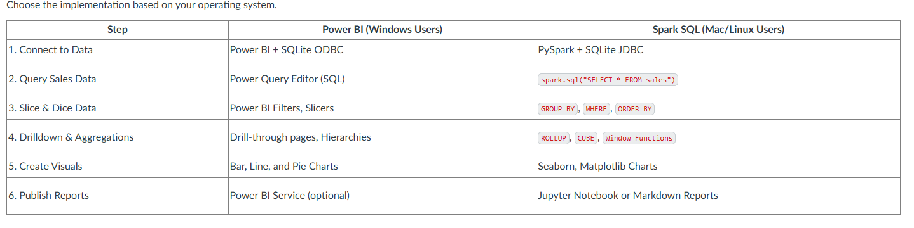
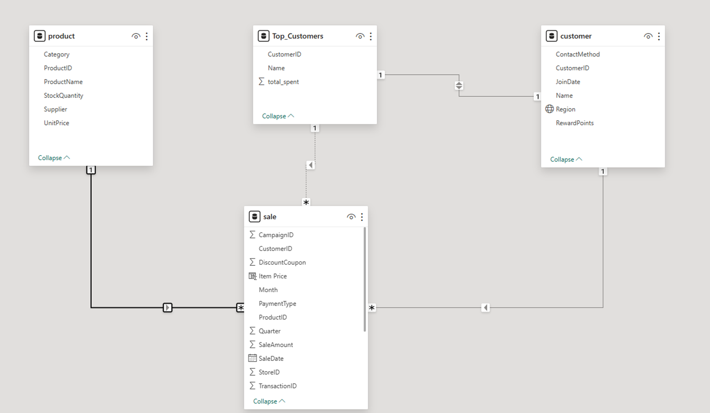
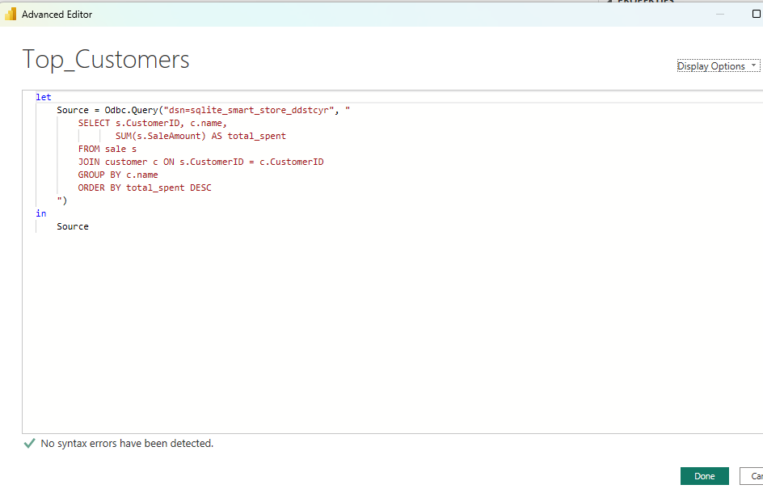
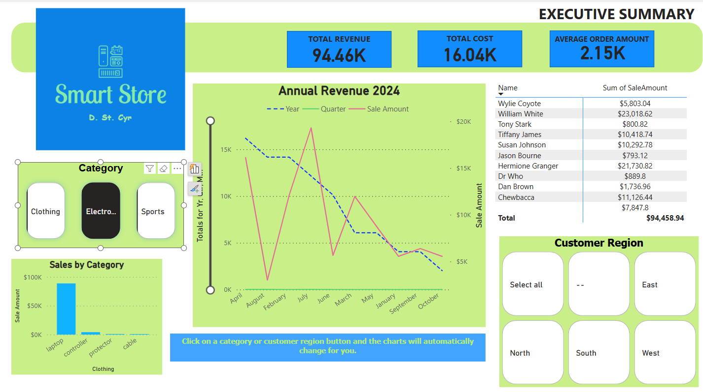

# smart-store-ddstcyr
Sales Project Instructions

#### Create a repository in Github for new project
- Make sure to add the README.md while creating the repository

### Add the following files to your root file which are obtained from Dr. Cases' repository  pro-analytics-01 from assignment number 1. 
* .gitignore (copy the contents and paste it in your file)
* requirements.txt (copy the contents and paste it in your file)

### Be sure to git push the new information to your repository in GitHub

### Add the following folders in this specific order
- data/
   - raw/
- scripts/
- utils/
   - logger.py (this is going to be a file)

### Create a virtual environment in VS Code editor if you haven't already
- It should be .venv and again should have been created from the first assignment. If you didn't, this is how to create it.
    - This page provides instructions to create a place in your project repository folder that will hold the Python virtual environment for the project. It provides an isolated Python environment for the project, so we don't mess up the global Python used by our machine.

      This is typically just done once at the beginning of a project. If it gets messed up, we can delete .venv and recreate it at any time.
  #### Before Starting
  - Open your project repository in VS Code.

  - We'll open a new terminal in VS Code and run a single command to create a new .venv folder for the local project virtual environment.

   #### Windows Users - Task 1. Create .venv
   On Windows, Use PowerShell (not cmd):
  - Run the following command from the project root directory.
    - py -m venv .venv

   #### Accept VS Code Suggestions
    If VS Code asks: We noticed a new environment has been created. Do you want to select it for the workspace folder? Click Yes
   #### ADVANCED OPTION (Create .venv when an Older Python Version is Required)
   Most projects can use the latest Python 3.x, but some tools (like Apache Kafka or Apache Spark) may require an older version.

   First, see the machine setup instructions to install additional versions of Python.

   Then, specify the required version when creating the virtual environment. For example:
   ##### On Windows, Use PowerShell (not cmd)
   py -3.11 -m venv .venv

### Be sure to git push the new information to your repository in GitHub

### 
---
##### 02-Project-Initialization
This section walks you through the steps to starting a new project [02-Project-Initialization] (./02-project-initialization/PROJECT-INITIALIZATION.md):

1. Copy an existing project OR start a new project from scratch.
2. Clone your new GitHub repo to your machine.
3. Add common files such as .gitignore and requirements.txt.
4. Git add-commit-push the changes to GitHub.
5. Create a local project virtual environment for Python.
   
##### 03-Repeatable-Workflow
Go to [03-Repeatable-Workflow] (./03-repeatable-workflow/REPEATABLE-WORKFLOW.md) for ongoing project development.
---
This section provides the repeatable steps for working on Python projects. These steps are typically followed whenever we make changes to a project. The workflow includes:

1. Pull any recent changes from GitHub.
2. Activate the virtual environment.
3. Install dependencies.
4. Run scripts and/or Jupyter notebooks.
5. Make updates, verify the code still runs, and git add-commit-push to GitHub.
---
### BI Python w/External Packages (.venv, execute, add-commit-push)
# smart-sales-starter-files

Starter files to initialize the smart sales project.

-----

## Project Setup Guide (1-Mac/Linux)

Run all commands from a terminal in the root project folder. 

### Step 1A - Create a Local Project Virtual Environment

```shell
python3 -m venv .venv
```

### Step 1B - Activate the Virtual Environment

```shell
source .venv/bin/activate
```

### Step 1C - Install Packages

```shell
python3 -m pip install --upgrade -r requirements.txt
```

### Step 1D - Optional: Verify .venv Setup

```shell
python3 -m datafun_venv_checker.venv_checker
```

### Step 1E - Run the initial project script

```shell
python3 scripts/data_prep.py
```

-----

## Project Setup Guide (2-Windows)

Run all commands from a PowerShell terminal in the root project folder.

### Step 2A - Create a Local Project Virtual Environment

```shell
py -m venv .venv
```

### Step 2B - Activate the Virtual Environment

```shell
.venv\Scripts\activate
```

### Step 2C - Install Packages

```shell
py -m pip install --upgrade -r requirements.txt
```

### Step 2D - Optional: Verify .venv Setup

```shell
py -m datafun_venv_checker.venv_checker
```

### Step 2E - Run the initial project script

```shell
py scripts/data_prep.py
```

-----

## Initial Package List

- pip
- loguru
- ipykernel
- jupyterlab
- numpy
- pandas
- matplotlib
- seaborn
- plotly
- pyspark==4.0.0.dev1
- pyspark[sql]
- git+https://github.com/denisecase/datafun-venv-checker.git#egg=datafun_venv_checker
---
### Prepare Data for ETL
##### Standardized Process Models
Organizations will propose standard "best practices" for common tasks. 

For example, for the overall process of mining information from data, there are several proposed standards such as CRISP-DMLinks to an external site., the Cross-industry standard process for data mining or SEMMA (Sample, explore, modify, model, assess from the SAS world). See https://www.starburst.io/blog/semma-vs-crisp-dm/Links to an external site.

Every business intelligence project deals with data cleaning. The exact process you use may depend on your data - and your tools - all business data has its own unique challenges. Following a standard process as much as possible is typically recommended. 
-----

##### Reusable Cleaning with a DataScrubber Class
Read about DATA_CLEANING_PROCESS_PANDAS.md in the GitHub repository at https://github.com/denisecase/smart-sales-docs/Links to an external site.

The Python pandas library makes cleaning data pretty easy - and once you learn or implement logic for one project, you can often reuse something similar for another. 

In data analysis, creating standardized cleaning functions ensures consistent, reliable data preparation across projects.

One popular approach to creating reusable logic in code is called "object oriented programming" or OOP. We can do this by creating a special DataScrubber class which provides a reusable, modular approach to data cleaning, which saves time and reduces error risk in future analyses.

We've made a good start on this DataScrubber class for you, and ask you to review the code, and finish the remaining TODO items. The TODO term is fairly common in code. You can use  CTRL f in VS Code to search for the word TODO -  or many of us install the VS Code Extension: ToDo TreeLinks to an external site. so we can see them as a list). 

Create the following file for this in your project:

scripts/data_scrubber.py (the module name is scripts.data_scrubber)

##### Unit Test the DataScrubber Class
To make it more engaging, we've also provided a DataScrubber test module that will test the logic in each of the DataScrubber methods (a special name for a class function).  

Once the tests pass 100%, you know you've got a good start on cleaning on prep functions. 

Create the following file for this in your project:

tests/test_data_scrubber.py - which will import and test the DataScrubber methods
The initial content for this file is available in the Module 3 repo: https://github.com/denisecase/smart-sales-docs/Links to an external site.
-----

##### Review and Complete the DataScrubber Class
Open tests/test_data_scrub.py to see the unit tests for each DataScrubber method. Run these tests to verify that each method in your DataScrubber class functions as intended. Modify your code as needed in data_scrub.py until all tests pass successfully.

In VS Code, with your project folder open, open a terminal window in your root project directory.
-----

###### Activate .venv
If not already active, activate your local project virtual environment with the appropriate command for your terminal.
In Windows PowerShell terminal: 
.\.venv\Scripts\activate

In macOS/Linux terminals:
source .venv/bin/activate
Verify your (.venv) is now active - it may appear in the terminal prompt.

###### Verify You've Installed All Required Packages (As Needed)

With the virtual environment activated, install the most current versions of the required packages which should be listed in your requirements.txt:

```shell
python -m pip install --upgrade -r requirements.txt
```

Hit the up arrow to rerun your installation command.
-----
###### Implement and Test General DataScrubber Class
-----


###### Run test script
In your VS Code terminal, with your local project virtual environment **active** (and all necessary packages installed),
run the test script with the following command. 

In Windows / PowerShell:

```shell
py tests\test_data_scrubber.py
```


In macOS/Linux terminal:

```shell
python3 tests\test_data_scrubber.py
```

The first time you run it, all tests will not pass correctly. 

------

### Finish DataScrubber Until All Tests Pass Successfully

Edit your scripts\data_scrubber.py file to complete the TODO actions. Verify by running the test script. 
Once all tests pass, you are ready to use the Data Scrubber in your data_prep.py (or other data preparation script). 
-----

###### Pass All Tests
Keep editing the DataScrubber class and running the test script until tests run successfully without error.  You do NOT need to modify the test script at all for this exercise. Later, if you add functionality to your DataScrubber class, you may want to add additional tests as well. 

------
###### Use Your Data Scrubber 
Now that we've verified all these handy methods, you can create or update your data_prep.py script that cleans and prepares the data so it's ready for central storage (in a data warehouse or other store)..

Right now, all files are cleaned in a single scripts/data_prep.py file, but you may find it better to have smaller files, maybe one per raw data table. 

Given the examples and the work done previously, read, clean, and preprocess all your raw data files and save the prepared versions in the data/prepared folder. 

We recommend a naming scheme - following this will make future assignments a bit easier as we will use these file names and locations, 
however, you are welcome to vary the names. Your future scripts will need to correctly reflect your folder and file naming conventions. 
Changing is harder and better for learning. If new, please follow our folder and file naming conventions exactly.

If your file is in the scripts folder, with a name of data_prep.py, you can run it with the appropriate command from a VS Code terminal open in the root project folder:
In Windows / PowerShell:

```shell
py scripts\data_prep.py
```


In macOS/Linux terminal:

```shell
python3 scripts\data_prep.py
```
OR:

Create or Edit Your Main Data Prep script(s)
In your main data preparation script (e.g., scripts\data-prep.py) - or scripts. There can be a LOT of work in cleaning, you might want to create and maintain one data_prep file for each of the raw tables, for example you might have either all in one:

scripts/data_prep.py 
Or several files:

scripts/data_prep_cutomers.py
scripts/data_prep_products.py
scripts/data_prep_sales.py
Use whatever works best for you. 

This project example helps illustrate a data-cleaning process that is somewhat standardized and reusable, facilitating efficient data preparation across multiple datasets and BI projects.

-----
###### Update Notes and Git add-commit-push
Update README.md

Document every command used in your data cleaning process in the README.md file, including the scripts used and any issues encountered or resolved.

Git add-commit-push
Use Git commands to add, commit, and push your latest changes, so your work is well-documented and versioned on GitHub.

Note: Smaller, more frequent commits are best - use a unique message after each step to keep very bit of incremental progress in your GitHub project repository. A useful commit history is a powerful indicator of good professional communication skills and can help us get back when things go awry. 

-------
###### Designing a Data Warehouse
Designing a Data Warehouse involves careful planning and understanding of both the data and the business requirements. Here are the key components and considerations involved:

### Schema Design

In Data Warehousing, schema refers to how the database is structured, and there are two popular designs:

- **Star Schema**: The simplest style of data mart schema that consists of one or more fact tables referencing any number of dimension tables, which help minimize the complexity of database design and queries.
- **Snowflake Schema**: A more complex schema where the dimension tables are normalized, which eliminates redundancy but may require more complex queries.

### Using SQLite for Schema Design

Given SQLite's lightweight and flexible nature, it is an excellent tool to implement and test schema designs. 

#### Example: Star Schema Design in SQLite


**Fact Table: Sales**

This table contains quantitative data for analysis, including metrics related to transactions such as `Quantity` and `SalesAmount`. It connects to dimension tables through foreign keys.

**Dimension Tables: Customers, Products**

Dimension Tables contain descriptive attributes related to the fact table. They provide context to the measures in the fact table.
  
- Customers Table: Contains information about customers, such as their `Name`, `Region`, and `JoinDate`.
- Products Table: Contains details about products, including `ProductName`, `Category`, and `UnitPrice`.

Design Considerations

- Normalization vs. Denormalization: While normalized tables reduce redundancy, denormalization can improve query performance. In a data warehouse, it's common to use a denormalized approach to optimize for read operations.
- Primary and Foreign Keys: Ensure primary keys uniquely identify each record in the dimension tables. Foreign keys in the fact table reference these primary keys, establishing relationships between tables.


## Data Warehouse Schema

In general, we will follow the convention that table names are lowercase and pluralized. 
Column names are all lowercase with underscores. 

### Fact Table: sales

| column_name     | data_type | description                     |
|-----------------|-----------|---------------------------------|
| sale_id         | INTEGER   | Primary key                     |
| date            | DATE      | Date of the transaction         |
| customer_id     | TEXT      | Foreign key to customers        |
| product_id      | TEXT      | Foreign key to products         |
| quantity        | INTEGER   | Quantity of items sold          |
| sales_amount    | REAL      | Total sales amount              |

### Dimension Table: customers

| column_name | data_type | description                       |
|-------------|-----------|-----------------------------------|
| customer_id | TEXT      | Primary key                       |
| name        | TEXT      | Name of the customer              |
| region      | TEXT      | Region where customer resides     |
| join_date   | DATE      | Date when the customer joined     |

### Dimension Table: products

| column_name  | data_type | description                      |
|--------------|-----------|----------------------------------|
| product_id   | TEXT      | Primary key                      |
| product_name | TEXT      | Name of the product              |
| category     | TEXT      | Category of the product          |
| unit_price   | REAL      | Price per unit of the product    |

A well-designed data warehouse is instrumental in enabling efficient data analysis and business intelligence reporting. 
We can use SQLite to simulate a data warehouse and gain practical experience in schema design and data management.

Next, we'll implement the data warehouse. 
----
# Create an Initial Data Warehouse Creation Script

Goal: Use SQLite to define and create tables for your data warehouse. The script will set up the database schema based on your design.

In this step, we'll sketch out a new script but leave the details until later. 
This is a common way to develop code. First, get the basics running, and then complete the details. 

## Open Project in VS Code, Create a New Script

Open your project in VS Code. Create a file in your scripts folder named create_dw.py. 

Start with some initial code. Maybe something like the following. 

```python
import sqlite3
import sys
import pathlib

# For local imports, temporarily add project root to Python sys.path
PROJECT_ROOT = pathlib.Path(__file__).resolve().parent.parent
if str(PROJECT_ROOT) not in sys.path:
    sys.path.append(str(PROJECT_ROOT))

# Now we can import local modules
from utils.logger import logger  # noqa: E402

# Constants
DW_DIR: pathlib.Path = pathlib.Path("data").joinpath("dw")
DB_PATH: pathlib.Path = DW_DIR.joinpath("smart_sales.db")

# Ensure the 'data/dw' directory exists
DW_DIR.mkdir(parents=True, exist_ok=True)


def create_dw() -> None:
    """Create the data warehouse by creating customer, product, and sale tables."""
    try:
        # Connect to the SQLite database
        conn = sqlite3.connect(DB_PATH)

        # Will need more magic here....

        # Close the connection
        conn.close()
        logger.info("Data warehouse created successfully.")

    except sqlite3.Error as e:
        logger.error(f"Error connecting to the database: {e}")
    except Exception as e:
        logger.error(f"An unexpected error occurred: {e}")
    finally:
        if conn:
            conn.close()

def main() -> None:
    """Main function to create the data warehouse."""
    logger.info("Starting data warehouse creation...")
    create_dw()
    logger.info("Data warehouse creation complete.")

if __name__ == "__main__":
    main()

```

In the Python script, use the sqlite3 library in the Python Standard Library to connect to SQLite and execute SQL commands to create tables.

- Define the schema for your fact and dimension tables.
- Ensure that your fact table includes foreign keys that reference the primary keys of your dimension tables.
- Follow conventions for naming tables and columns.

## Activate .venv and Excecute the Script

In VS Code, open a terminal. 
Activate the local project virtual environment if not already active. 
Use the variation of this command that works on your machine. 

In Windows / PowerShell (for example)

```shell
.\.venv\Scripts\activate
```

In Mac / Linux terminal (for example)

```shell
source .venv/bin/activate
```

## Execute the Script

Execute the script to create the database and tables - use the command that works for your operating system. 

In Windows / PowerShell

```shell
py scripts/create_dw.py
```

In Mac / Linux terminal

```shell
python3 scripts/create_dw.py
```

### Verify And Plan Ahead
-Make sure this version runs correctly. 
In the next session, we'll write code to create the tables. 
We will NOT populate them. We'll do that separately using our prepared data in Module 5. 
------ 
### Cross Platform Reporting with Power BI & Spark
#### Scenario
Now that we have designed and populated our data warehouse (P4), we will analyze and visualize the stored data to generate business intelligence insights.

Reporting tools allow us to turn raw data into actionable insights that drive business decisions. Since BI professionals work across multiple platforms, this project ensures that everyone gains equivalent experience, regardless of operating system. Windows users will work with Power BI Desktop.
Mac/Linux users will implement the same concepts using Spark SQL and Python.
We will apply core BI techniques (slicing, dicing, and drilldown) and generate interactive visualizations to explore business performance. This project reinforces key data analysis and reporting skills used across industries.
---
### Objectives
* Connect to an SQLite database for analysis
* Write and execute SQL queries for reporting
* Implement slicing, dicing, and drilldowns
* Create interactive visualizations
* Explore scalability & cloud-based solutions
---
#### Implementation By Operating System
Choose the implementation based on your operating system.


---
#### Task 1: Set Up Your BI Environment
##### Windows (Power BI) -  Initial Setup
We’ll use Power BI Desktop and an ODBC connection to read data from our SQLite database. There are 3 key tasks:

1.  Install Power BI Desktop (if you haven't yet) from: https://powerbi.microsoft.com/downloadsLinks to an     external site.
2.  Install SQLite ODBC Driver  from: https://www.ch-werner.de/sqliteodbcLinks to an external site.
3.  Configure ODBC Data Source Name (DSN)
   
See this video (or work with your AI) How to Connect Power BI with SQLite Database and Import Data - 6 minute video
https://www.youtube.com/watch?v=v9OG5Ry5zDULinks to an external site.
https://www.youtube.com/watch?v=v9OG5Ry5zDU

More help on Task 3 (after installing the ODBC driver):

1.  Open ODBC Data Sources (64-bit) from the Start Menu.
2.  Click the System DSN tab.
3.  Click Add... → choose SQLite3 ODBC Driver (or whatever data store you are using) → click Finish.
4.  Name it SmartSalesDSN (or any name you prefer).
5.  Click Browse and select your database file: e.g., smart_sales.db (or whatever you named it). 
6.  Click OK to save.

---

#### Task 2: Connect to Your Data Warehouse 
Now, we need to establish a connection between our BI tool and our SQLite data warehouse (e.g., smart_sales.db).

#### Windows (Power BI) - Load Tables
1.  Open Power BI Desktop.
2.  Click Get Data (top left) → Select ODBC from the list.
3.  Choose the DSN you created in Task 1 (e.g., SmartSalesDSN).
4.  Click OK. Wait a moment. Power BI will show a list of available tables.
5.  Select the tables you want to analyze - for most of us: 
    1.  Customer table
    2.  Product table
    3.  Sales table
6.  Click Load to bring the tables into Power BI.
7.  Switch to Model view (left panel) to see how the tables are connected.

---

#### Task 3: Query & Aggregate Data 
We will query the data warehouse and extract key insights.

#### Windows (Power BI) - SQL Query Editor
We’ll use Power BI’s Advanced Editor to write a custom SQL query.

1.  Open Power BI Desktop.
2.  In the Home tab, click Transform Data to open Power Query Editor.
3.  In Power Query, click Advanced Editor (top menu).
4.  Delete any code in the editor and replace it with your SQL query (example below). You must use your table names and column names for the SQL to work. 

SELECT c.name, SUM(s.amount) AS total_spent
FROM sale s
JOIN customer c ON s.customer_id = c.customer_id
GROUP BY c.name
ORDER BY total_spent DESC;

1.  Click Done.
2.  Rename the new query (on the left) to something like Top Customers or whatever you are focusing on.
3.  Click Close & Apply (upper left) to return to the report view.
4.  You can now use this table in visuals (e.g., bar chart).

---

#### Task 4: Slice, Dice, and Drilldown
We will implement slicing, dicing, and drilldown techniques to analyze sales.

#### Windows (Power BI) - Slice, Dice, and Drilldown
1.  Slicing: Add a date range slicer
2.  Dicing: Create a matrix visual for sales by product & region
3.  Drilldown: Enable drill-through to explore sales by year → quarter → month
---
##### Task 1: Slicing in Power BI (by Date)

Since SQLite doesn’t have real "Date" fields, we’ll use Power BI's Transform Data to extract parts of the date for slicing, dicing, and drilldown.

1.  Click Transform Data to open Power Query.
2.  Select the sales table.
3.  Select the order_date column (or any "date" field).
4.  On the top menu, click Add Column → Date → Year.
5.  Then click Add Column → Date → Quarter.
6.  Then click Add Column → Date → Month → Name of Month.
7.  Click Close & Apply to save changes and return to the report view.
8.  In Power BI, go to the Report view (center icon on the left).
9.  From the Visualizations pane, click on the Slicer icon.
10. Drag a date field into the slicer.
11. If it doesn’t show a range, click the dropdown (upper-right corner of slicer) and select Between to enable a date range slider.
---
#### Task 2: Dicing in Power BI (by Product Attributes)

To explore sales by product attributes (e.g. category and region or other characteristics), we’ll create a Matrix visual in Power BI.

1.  Go to the Report view.
2.  From the Visualizations pane, click the Matrix visual.
3.  Drag your first product feature (e.g. category) to the Rows field well.
4.  Drag your first product feature (e.g. region) to the Columns field well.
5.  Drag a numeric field to the Values field well.
6.  Optional: Format the numeric values by clicking the column dropdown in the Values area.
This matrix will help us “dice” the data and break it down by two categorical dimensions: product and region.
---
#### Task 3: Drilldown in Power BI (Year → Quarter → Month)

To explore sales over time, we’ll use a column or line chart and enable drilldown so we can click into sales by year, quarter, and month.

1.  Go to the Report view.
2.  From the Visualizations pane, click on either the Clustered Column Chart or Line Chart.
3.  Drag your Year, Quarter, and Month fields (created earlier from order_date) into the X-Axis or Axis field in that order:
        1.  First: order_year
        2.  Then: order_quarter
        3.  Then: order_month
4.  Drag your numeric value (e.g., total amount) into the Values area.
5.  At the top left of the chart, click the drilldown arrow icon (a split-down arrow).
6.  Click on a bar or line point in the chart to drill from Year → Quarter → Month.
7.  To move back up, click the up arrow near the same spot.

If nothing happens when clicking, make sure the chart supports hierarchy and the drilldown mode is active (look for the split arrow).
---

### Task 5: Create Interactive Visualizations (60 min)
We will now visualize the results in both Power BI and Python (Seaborn/Matplotlib).

#### Windows (Power BI) - Charts
1.  Create a bar chart for Top Customers
2.  Create a line chart for Sales Trends
3.  Add a slicer for product categories
4.  To create your visuals:

Go to Report View.
1.  Use the Visualizations pane to choose a chart (e.g., Bar, Line).
2.  Drag the appropriate field into the chart (e.g., customer name to Axis, total spent to Values).
3.  Use Slicers to filter by category or region if you’ve added those earlier.

---
### Task 6: Document & Submit Your Work (30 min)
Update README.md

1.  Describe your SQL queries and reports.
2.  Explain dashboard design choices.
3.  Include screenshot of: Power BI Model View / Spark SQL Schema
4.  Include screenshot of: Query results
5.  Include screenshot of: Final Dashboard / Charts


Screenshot of Power BI Model View 


Screenshot of Query results



Screenshot of Final Power BI Dashboard and Charts


Git Add-Commit-Push - do this at the end, but it's also good to do after each improvement. Practice is key - and it's a powerful professional practice. Small, frequent git commits are best. 

git add .
git commit -m "Completed analysis and visualization"
git push -u origin main

---

